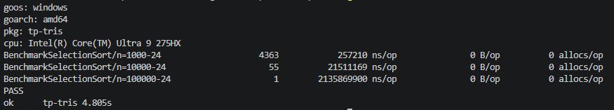
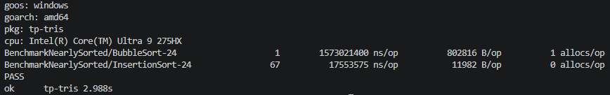
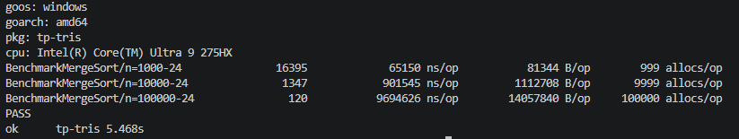
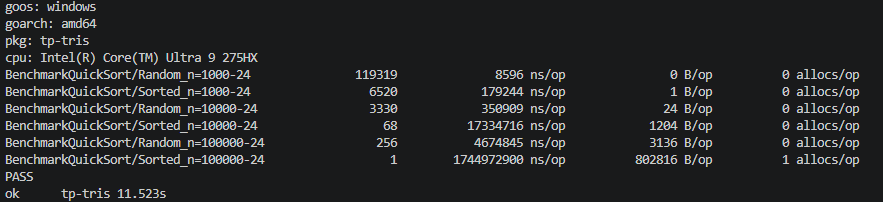
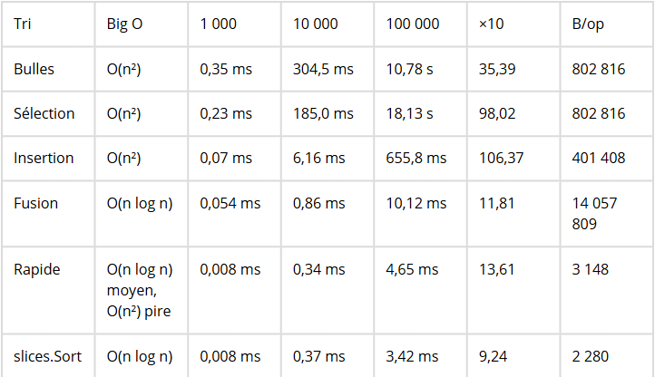
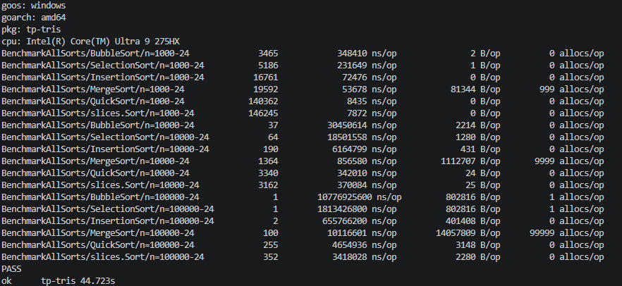
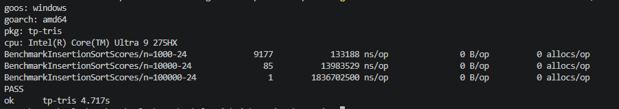
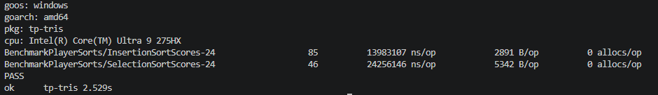

# TP - Algorithmique de tri en GO 
-------------------------------------- 

lien github : https://github.com/Juuuules83/tp-tris.git 

-------------------------------------- 

## EX01 - Le tri à bulles : 

### Question : mesurez votre tri sur SortedScores(10 000), puis sur ReversedScores(10 000). Expliquez l'écart. 
### Que se passerait-il si votre tri ne s'arrêtait pas après un passage sans échange ? 

Pour SortedScores(10 000) , le tableau est déjà trié. Le tri fait donc un passage sans échange et s'arrête rapidement.
Pour ReversedScores(10 000) , le tableau est dans l'ordre inverse. Le tri doit effectuer beaucoup plus d'échanges et de passages, ce qui explique que le temps d'exécution soit beaucoup plus élevé.
La complexité du tri à bulles est de O(n²) dans le pire cas. Pour un tableau déjà trié, elle est de O(n) grâce à l'arrêt après un passage sans échange.
Si le tri ne s'arrêtait pas après un passage sans échange, il continuerait à parcourir le tableau alors qu'il est déjà trié. Il ferait donc des comparaisons inutiles et prendrait plus de temps .

### Capture du benchmark :

**Commande pour lancer le bench :**  
`go test -bench=BubbleSort -benchmem -run='^$'`

-------------------------------------- 

## EX02 - Le tri par sélection : 

### Question : mesurez votre tri sur RandomScores(10 000), SortedScores(10 000) et ReversedScores(10 000). Que constatez-vous, et pourquoi ? Comparez avec le tri à bulles. 

Le tri par sélection effectue toujours une recherche du minimum dans la partie du tableau qui n'est pas encore triée.
Même si le tableau est déjà trié ou dans l'ordre inverse, il doit continuer à parcourir les éléments pour chercher le minimum.
Il a donc une complexité de O(n²) dans les différents cas.
Contrairement au tri à bulles, il ne profite pas de l'arrêt anticipé lorsque le tableau est déjà trié.

### Capture du benchmark :

**Commande pour lancer le bench :**  
`go test -bench=SelectionSort -benchmem -run='^$'`

-------------------------------------- 

## EX03 - Le tri par insertion : 

### Question : mesurez BubbleSort et InsertionSort sur NearlySortedScores(100 000). Les deux tris sont en O(n²) dans le pire cas : pourquoi l'un est-il beaucoup plus rapide que l'autre sur des données presque triées ? 

Sur un tableau presque trié, InsertionSort est beaucoup plus rapide car il déplace seulement les éléments qui ne sont pas à leur place.
BubbleSort doit effectuer plusieurs passages sur le tableau.
On voit donc que deux algorithmes ayant la même complexité dans le pire cas peuvent avoir des performances très différentes selon les données utilisées.

### Capture du benchmark :

**Commande pour lancer le bench :**  
`go test -bench=NearlySorted -benchmem -run='^$'`

-------------------------------------- 

## EX04 - Le tri fusion : 

### Question : comparez la colonne B/op du tri fusion à celle des tris précédents. D'où vient cette mémoire, et combien d'octets représente-t-elle pour 100 000 scores ? 

MergeSort utilise beaucoup plus de mémoire que les tris précédents car il crée de nouveaux slices lors de la fusion.
Pour 100 000 scores, le benchmark donne environ **14 057 809 B/op**.
Les tris comme BubbleSort, SelectionSort et InsertionSort travaillent directement sur le tableau, alors que MergeSort crée des tableaux temporaires pour effectuer les fusions.

### Capture du benchmark :

**Commande pour lancer le bench :**  
`go test -bench=MergeSort -benchmem -run='^$'`

-------------------------------------- 

## EX05 - Le tri rapide (bonus) : 

### Question : que se passe-t-il sur SortedScores(100 000) ? Proposez un meilleur choix de pivot, implémentez-le et mesurez le gain. 

Avec QuickSort, le dernier élément est utilisé comme pivot.
Sur un tableau déjà trié, le dernier élément est toujours le plus grand. Le tableau est donc très mal séparé à chaque étape.
La complexité peut alors atteindre O(n²), ce qui explique le temps beaucoup plus élevé observé sur SortedScores(100 000).
Un meilleur choix serait par exemple de choisir un pivot au milieu du tableau ou de choisir un pivot aléatoire.

### Capture du benchmark :

**Commande pour lancer le bench :**  
`go test -bench=QuickSort -benchmem -run='^$'`

-------------------------------------- 

## EX06 - Le grand comparatif : 

### Résultats du benchmark :

### Question : à partir de quelle taille les tris en O(n log n) deviennent-ils nettement plus rapides que les tris en O(n²) ? Vos rapports ×10 confirment-ils les complexités annoncées ? 

À partir de 10 000 éléments, les tris en O(n log n) deviennent déjà nettement plus rapides que les tris en O(n²).
Les rapports ×10 montrent bien la différence entre les deux familles. Les tris en O(n²) augmentent beaucoup plus fortement, alors que les tris en O(n log n) restent beaucoup plus raisonnables .

### Question : slices.Sort repose lui aussi sur un tri rapide. Pourquoi est-il plus rapide que votre QuickSort ? 

`slices.Sort` est plus rapide car il s'agit d'une implémentation de la bibliothèque standard de Go, qui est optimisée pour les performances et gère mieux différents cas que notre implémentation simple de QuickSort .

### Capture du benchmark :

**Commande pour lancer le bench :**  
`go test -bench=AllSorts -benchmem -run='^$' -timeout 30m`

-------------------------------------- 

## EX07 - Adapter le tri par insertion : 

### Question : comparez le temps avec celui d'InsertionSort sur RandomScores(n). Qu'est-ce qui change, et pourquoi ? 

InsertionSortScores trie des structures `Score` au lieu de simples entiers.
Sur 10 000 éléments, InsertionSortScores prend environ **13 983 107 ns/op**, ce qui est quasiment identique à InsertionSort sur 10 000 scores avec environ **13 983 529 ns/op**.
La différence est donc très faible. Le tri reste en O(n²) et la comparaison se fait simplement sur le champ `Score` .

### Capture du benchmark :

**Commande pour lancer le bench :**  
`go test -bench=InsertionSortScores -benchmem -run='^$'`

-------------------------------------- 

## EX08 - Les ex æquo et la stabilité : 

### Question : lesquels de vos tris sont stables ? Expliquez, en rejouant l'exemple avec les cartes, pourquoi le tri par sélection ne l'est pas. 

InsertionSortScores est stable car lorsqu'il y a deux joueurs avec le même score, leur ordre d'arrivée est conservé .
SelectionSortScores n'est pas stable car il peut échanger directement deux éléments. Cet échange peut inverser l'ordre de deux joueurs ayant le même score .

Avec l'exemple :

`[{A 5} {B 5} {C 9}]`

un tri stable donne :

`[{C 9} {A 5} {B 5}]`

alors qu'un tri par sélection peut donner :

`[{C 9} {B 5} {A 5}]`

### Capture du benchmark :

**Commande pour lancer le bench :**  
`go test -bench=PlayerSorts -benchmem -run='^$'`

-------------------------------------- 