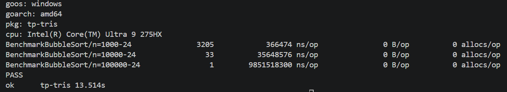

# TP - Algorithmique de tri en GO 
------------------------------------- 

lien github : https://github.com/Juuuules83/tp-tris.git 

------------------------------------- 

## EX01 - Le tri à bulles : 

voici le résultat du benchmark  
-> 

**Commande pour lancer le bench :** _go test -bench=BubbleSort -benchmem -run='^$'_   

-------------------------------------- 

## EX02 - Le tri par sélection : 

voici le résultat du benchmark V1 
->  

**Commande pour lancer le bench :** _ // _   

-------------------------------------- 
